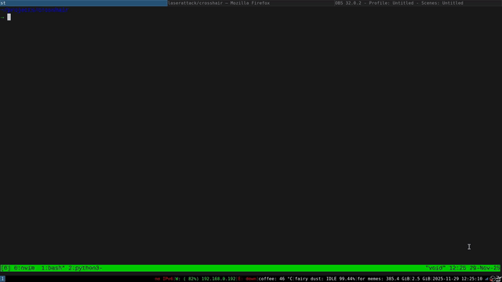

# Crosshair

A lightweight overlay tool that displays a red crosshair over all windows on X11 systems



# Quick Start

compile:

```bash
make
```

run:

```bash
./crosshair
```

Press `ctrl+q` anywhere to exit
